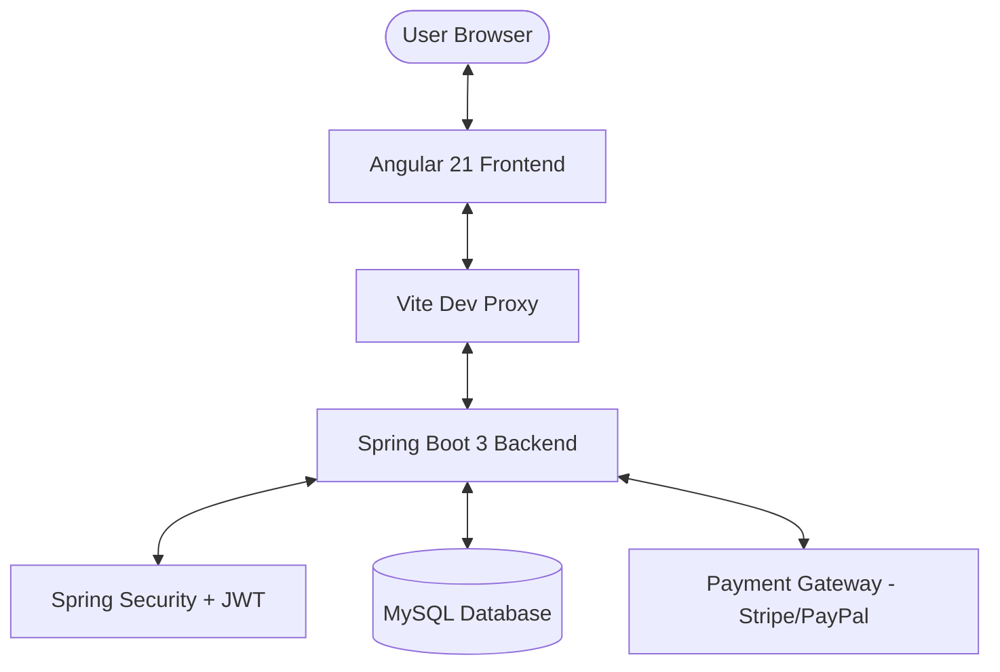

# PayMate — Premium Expense Splitting & Payment Platform

PayMate is a full-stack, enterprise-grade expense management and group-payment splitting platform. Built with **Spring Boot 3** and **Angular 21**, it features a modern **Glassmorphism UI**, real-time balance tracking, and secure payment integrations.

---

## 🚀 Key Features

- **Dynamic Glassmorphism UI:** A premium, responsive dashboard designed with high-end CSS aesthetics and micro-animations.
- **Smart Expense Splitting:** Handles complex group balances with support for multiple users.
- **Zoneless Change Detection:** Optimized frontend performance using Angular 21's native zoneless scheduler.
- **Secure Authentication:** JWT-based stateless authentication with role-based access control (RBAC).
- **Payment Hooks:** Integration-ready for Stripe and PayPal with status tracking.
- **CORS-Free Development:** Configured with a Vite-based development proxy for seamless frontend-backend communication.

---

## 🧱 Architecture

---

## 📡 Tech Stack

| Layer | Technologies |
| :--- | :--- |
| **Frontend** | Angular 21, TypeScript, RxJS, Angular Material, GSAP/Animations |
| **Backend** | Java 21, Spring Boot 3.1.5, Spring Security, JPA/Hibernate |
| **Database** | MySQL 8.0 |
| **Payments** | Stripe, PayPal |
| **Auth** | JWT (JSON Web Tokens) |
| **Tools** | Maven, Postman, Vite, Docker |

---

## �️ Setup Instructions

### Backend (Spring Boot)
1. Navigate to `/backend`.
2. Configure `application.properties` with your MySQL credentials.
3. Run `./mvnw spring-boot:run`.

### Frontend (Angular)
1. Navigate to `/frontend`.
2. Run `npm install`.
3. Run `npm start` (starts the Vite server with proxy configured to `localhost:8081`).

---

## 📝 Recent Improvements
- ✅ **Fixed Change Detection:** Resolved "infinite loading" issues by implementing `provideZonelessChangeDetection` and manual change triggering in async HTTP streams.
- ✅ **Optimized CORS:** Eliminated preflight conflicts by routing all traffic through a dedicated development proxy.
- ✅ **Enhanced Error Handling:** Implemented robust RxJS error catching and timeout logic to ensure a fail-safe user experience.

---

## 🛡️ License
Distributed under the MIT License.
